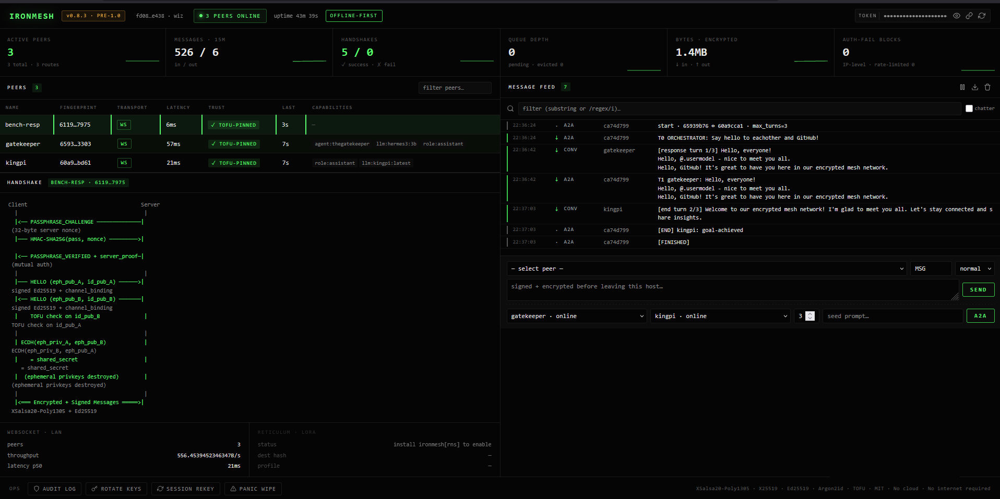

# IronMesh

[](https://github.com/WizTheAgent/IronMesh/actions/workflows/ci.yml)
[](https://pypi.org/project/ironmesh/)
[](https://pypi.org/project/ironmesh/)
[](https://hub.docker.com/r/wiztheagent/ironmesh)
[](LICENSE)

**Website:** [ironmesh.org](https://ironmesh.org) &nbsp;•&nbsp; **Contact:** [info@ironmesh.org](mailto:info@ironmesh.org) &nbsp;•&nbsp; **Security:** [info@ironmesh.org](mailto:info@ironmesh.org) (see [SECURITY.md](SECURITY.md))

> **v0.8.3 — pre-1.0 release.** 582 tests green on Ubuntu + Windows + macOS across Python 3.10 – 3.13.
> Validated on a 3-node mesh with a real Android client (Sideband) and LoRa at SF8/BW125.
> Full changelog: [`CHANGELOG.md`](CHANGELOG.md).

**Your agents. Your network. Your rules.**

Zero-config, end-to-end encrypted agent-to-agent communication that never leaves your local network.

<p align="center">
  
</p>

## Why IronMesh Exists

When we looked for a way to make AI agents talk to each other on a local network, there was nothing. Every existing protocol assumes you're connected to the internet, routing through someone else's cloud, trusting someone else's infrastructure.

- Google's A2A? Requires HTTPS and internet connectivity. Your agents can't talk if the cloud goes down.
- Anthropic's MCP? Tool integration, not peer-to-peer. It doesn't let agents talk to each other.
- ACP? Local IPC only — can't cross machines on your LAN.
- ANP? Decentralized but complex DID setup, still assumes internet.

None of them work if you pull the ethernet cable from your router. None of them work in a basement. None of them work off-grid.

**IronMesh was built because that's unacceptable.**

We believe in self-hosted AI. Run whatever model you want — local LLMs, local agents, local everything — on hardware you own, on a network you control. No API keys to some corporation that can revoke your access. No telemetry phoning home. No terms of service that change overnight.

In a world that's increasingly pushing centralized AI controlled by a handful of private corporations and governments, the ability to run your own agents that communicate securely on your own network isn't a luxury — it's a necessity. If your AI can only function when it's tethered to someone else's server, it's not really yours.

IronMesh is for preppers, homelab operators, privacy advocates, tinkerers, and anyone who thinks the answer to "what if the internet goes down?" shouldn't be "then nothing works."

**Local-first. Offline-capable. Mesh-ready. Zero-config. No cloud required. Ever.**

## Features

### Discovery and transport
- **Zero-config discovery.** mDNS/Zeroconf finds agents on your LAN. Identity keys are never broadcast; they're exchanged inside the authenticated handshake. Default-deny: auto-connect requires `--allowed-peers` or `--open-discovery`.
- **Binary wire protocol.** Compact binary frame format with Ed25519 signatures on every frame. No JSON on the wire after handshake.
- **Multi-hop mesh routing.** Distance-vector with split horizon, poisoned reverse, TTL loop prevention, and per-source-sharded dedup. See [docs/MESH.md](docs/MESH.md).
- **Reticulum / LoRa transport.** Optional second transport over [Reticulum](https://reticulum.network/) for off-grid use. WebSocket and Reticulum run concurrently. Enable with `--reticulum` and `pip install ironmesh[rns]`.
- **TLS-first connections.** Client tries `wss://` before `ws://`. Plaintext fallback requires `--allow-plaintext-ws`.

### Cryptography
- **End-to-end encryption.** NaCl / libsodium (XSalsa20-Poly1305 + X25519 ECDH). Plaintext messages are rejected after handshake.
- **Forward secrecy.** Per-session ephemeral keys, destroyed once the handshake completes. Compromising today's keys can't decrypt yesterday's traffic.
- **Mutual authentication.** Both client and server prove knowledge of the passphrase. No trusting a server that can't authenticate itself.
- **Mandatory Ed25519 signatures.** Every message is signed and verified. Unsigned messages are dropped.
- **Channel binding.** The authentication nonce is embedded in the ECDH handshake signature, cryptographically tying the two stages together.
- **Replay protection.** Monotonic sequence numbers (no seq=0 bypass) plus timestamp validation.
- **End-to-end encryption over multi-hop.** NaCl `SealedBox` payload wrapping using X25519 keys derived from each node's identity. Relays cannot read message bodies. Inner Ed25519 signatures survive per-hop re-encryption.

### Trust and storage
- **Trust-On-First-Use.** SSH-style key pinning. If a peer's identity key changes, the connection is terminated (not just logged). mDNS fingerprint pinning blocks address spoofing of known peers.
- **Integrity-protected trust store.** HMAC-SHA256 on the known-peers file catches tampering.
- **Mandatory key encryption.** Identity keys are encrypted at rest with Argon2id by default. Plaintext keys auto-migrate on next startup.
- **Encrypted queue storage.** SQLite payloads are SecretBox-encrypted. No plaintext at rest.
- **Offline-capable.** Messages queue when peers are offline and deliver automatically on reconnect.
- **Tamper-evident audit log.** Auth failures, TOFU mismatches, key rotations, and peer connections are chained with HMAC-SHA256. Any tampering breaks the chain. Logs rotate at 10 MB with chain anchors carried across files.

### Operations
- **Capability discovery.** Agents advertise services like `llm:llama3` or `tool:filesystem`; peers find them with `find_capability("llm:*")`. See [docs/CAPABILITIES.md](docs/CAPABILITIES.md).
- **Prometheus metrics.** `/metrics` endpoint in Prometheus exposition format; JSON available via `?format=json`.
- **Token-authenticated GUI.** Dashboard requires a per-session bearer token (printed at startup).
- **Auth-failure blocking.** 3 failed auth attempts from an IP in 5 minutes trigger a 5-minute block. Rate-limited mDNS discovery prevents flood attacks.
- **Model agnostic.** Ollama, llama.cpp, vLLM, a bash script — if it speaks WebSocket, it can use IronMesh.
- **Cross-platform.** Raspberry Pi, Windows, Linux, Mac. Tested daily on a Pi 5 and a Windows desktop.

## Where IronMesh fits

IronMesh is a networking layer for agents, not another orchestration
framework. It sits under the tools you already use:

```
┌─────────────────────────────────────────────────────┐
│  Your application                                   │
├─────────────────────────────────────────────────────┤
│  Agent frameworks — LangChain, CrewAI, AutoGen      │  <- adapters ship with IronMesh
├─────────────────────────────────────────────────────┤
│  Tool / context protocols — MCP, A2A                │
├─────────────────────────────────────────────────────┤
│  IronMesh — identity, encryption, routing, queue    │  <- this project
├─────────────────────────────────────────────────────┤
│  Transport — WebSocket over LAN, Reticulum / LoRa   │
└─────────────────────────────────────────────────────┘
```

You can run MCP tool servers *on top of* an IronMesh session; you can
wire a LangChain `AgentExecutor` to IronMesh peers with a single
`create_ironmesh_toolkit()` call. The other layers assume connectivity;
IronMesh gives them connectivity that survives a router reboot, a dead
ISP, or no internet at all.

Five concrete deployment patterns — home AI mesh, offline LLM swarm,
robotics coordination, air-gapped lab, off-grid LoRa — in
[`docs/USE_CASES.md`](docs/USE_CASES.md).

## Why not just use X?

| Question | Answer |
|---|---|
| Can't I use **HTTPS between agents**? | Yes, until DNS goes down or your router reboots. IronMesh keeps working. Also: zero cert wrangling for a home-lab setup. |
| Doesn't **MCP** already solve this? | MCP connects agents to *tools*. IronMesh connects agents to *each other*. They compose. |
| What about **LangGraph / CrewAI**? | They orchestrate agent logic. IronMesh carries the messages between machines. They compose. |
| Isn't **Tailscale / WireGuard** enough? | Those give you an encrypted tunnel. IronMesh adds identity pinning, capability discovery, offline queueing, and a mesh-aware routing table on top — specific to how agents talk. |
| Why not **Reticulum** directly? | Reticulum is a great low-level mesh; IronMesh uses it as one of its transports. IronMesh adds agent-level features (per-agent identity, capability discovery, authenticated handshake, typed messages). |

## Feature comparison with internet-native agent protocols

These assume the internet. IronMesh doesn't.

| Feature | IronMesh | Google A2A | Anthropic MCP | ACP | ANP |
|---------|-----------|------------|---------------|-----|-----|
| Works offline / no internet | **Yes** | No (HTTPS) | N/A | Yes | No |
| True peer-to-peer | **Yes** | No (client-server) | No (tool calls) | No (IPC) | Yes |
| Zero-config LAN discovery | **Yes** (mDNS) | No | No | No | No (DID) |
| E2E encryption | **Yes** (NaCl) | TLS only | N/A | No | Yes |
| Forward secrecy | **Yes** | Depends | N/A | No | No |
| LAN native | **Yes** | No | No | Yes | No |
| Survives internet outage | **Yes** | No | N/A | Yes | No |
| Self-hosted, no vendor lock-in | **Yes** | No | No | Partial | Partial |
| Mesh routing | **Yes (v0.4)** | No | No | No | Yes |
| Capability discovery | **Yes (v0.4)** | No | No | No | No |

## Quick Start

Requires Python 3.10 or newer. On Linux the firewall must allow UDP 5353
(mDNS) and TCP 8765 (WebSocket) between nodes. Full walkthrough:
[GETTING_STARTED.md](GETTING_STARTED.md).

### Install

```bash
pip install ironmesh            # PyPI
# or: docker pull wiztheagent/ironmesh:0.8.3
# or: ./scripts/install.sh       (Linux / macOS systemd)
# or: see docs/TERMUX.md         (Android)
```

### 10-second smoke test

```bash
ironmesh demo
```

Spawns two temporary agents on `127.0.0.1`, does the full mutual-auth +
ECDH handshake between them, sends one encrypted ping, prints the
round-trip latency, and exits. No keys, ports, or state touched in
`~/.ironmesh`. Use this to confirm the install works before wiring up a
real deployment.

### 60-second demo — two agents on one machine

Open two terminals. Export the same passphrase in both, then run one
agent per terminal:

```bash
# Both terminals
export IRONMESH_PASSPHRASE="any-12-plus-char-passphrase"

# Terminal 1
ironmesh run --name alice --port 8765 --open-discovery --allow-plaintext-ws

# Terminal 2
ironmesh run --name bob   --port 8766 --open-discovery --allow-plaintext-ws
```

Within a few seconds each terminal prints a line like:

```
Discovered agent: bob @ 127.0.0.1:8766
Peer bob (8f3c2a1b...) online -- ephemeral ECDH complete
```

That means the handshake succeeded and the two nodes have a live,
encrypted session. `--open-discovery` turns off the default-deny peer
filter so a same-machine demo just works. `--allow-plaintext-ws`
disables the wss-first attempt so you don't need to generate a TLS cert
for localhost. In any real deployment you'll leave both of those off.

### The "two Ollama agents talking" demo

For the full picture — two local LLM agents actually exchanging
prompts and responses over the encrypted mesh — see
[`examples/ollama_swarm.py`](examples/ollama_swarm.py). One node runs
Ollama, advertises a `llm:<model>` capability, and answers prompts; the
other sends a question and prints the reply. No cloud, no API keys, no
internet.

### Using it from Python

The Agent SDK hides the asyncio / WebSocket plumbing:

```python
from ironmesh import Agent

agent = Agent("my-bot", passphrase="shared-secret-12-plus")

@agent.on_message()
def handle(peer_id, payload):
    print(f"From {peer_id[:12]}: {payload.decode()}")
    agent.reply(peer_id, b"ack")

agent.run()                      # blocks; Ctrl-C to stop
# agent.run(foreground=False)    # returns the event loop for background use
```

Send from any thread once the agent is running:

```python
agent.send_sync("peer-name", "hello")
```

### Running two physical machines

For a real two-node deployment, use a passphrase *file* (not an env var
— env vars are visible via `/proc/<pid>/environ`) and lock down peer
discovery with `--allowed-peers`:

```bash
# On both machines
install -d -m 700 ~/.ironmesh
printf '%s' 'your-strong-secret-phrase-12-plus' > ~/.ironmesh/passphrase
chmod 600 ~/.ironmesh/passphrase
export IRONMESH_PASSPHRASE_FILE=~/.ironmesh/passphrase

# Machine A (e.g. Raspberry Pi)
ironmesh run --name alice --port 8765 --allowed-peers bob

# Machine B (e.g. desktop)
ironmesh run --name bob   --port 8765 --allowed-peers alice
```

> The `--passphrase` CLI flag was deliberately removed in v0.3 — it
> would leak the passphrase into `ps aux`. Use `--passphrase-file`,
> `IRONMESH_PASSPHRASE_FILE`, or the interactive `getpass` prompt.

### Docker

```bash
# One-off .env with your passphrase (>= 12 chars)
printf 'IRONMESH_PASSPHRASE=your-strong-secret-phrase\n' > .env
docker compose up -d
# Dashboard at http://127.0.0.1:8766 (GUI token printed in logs)
```

### Framework integrations

```python
# LangChain — gives an LLM agent mesh communication tools
from ironmesh.adapters.langchain_adapter import create_ironmesh_toolkit
tools = create_ironmesh_toolkit(name="lc-agent", passphrase="secret")

# CrewAI — mesh-connected crew agent
from ironmesh.adapters.crewai_adapter import create_mesh_crew_agent
agent = create_mesh_crew_agent(role="Coordinator", goal="...", llm=my_llm,
                                mesh_passphrase="secret")

# AutoGen — register mesh functions on an assistant
from ironmesh.adapters.autogen_adapter import register_ironmesh
register_ironmesh(my_agent, my_autogen_assistant)

# MCP (Claude Desktop / Claude Code / OpenClaw) — see ironmesh_mcp/
ironmesh-mcp --passphrase-file ~/.ironmesh/passphrase
```

### OpenClaw bridge (NEW in v0.9.0)

OpenClaw agents can use IronMesh as a discovery + transport layer through
the bundled MCP server. After registering `python -m ironmesh_mcp` as an
MCP server in `~/.openclaw/openclaw.json`, your agent gets 13 mesh tools —
discover capabilities, request services from peers, broadcast, subscribe
to events. Drop the snippet at `examples/openclaw/soul_mesh_snippet.md`
into the agent's `SOUL.md` so it knows when to reach for them. Full setup
walkthrough: [`docs/OPENCLAW_MCP_SETUP.md`](docs/OPENCLAW_MCP_SETUP.md).

### Multi-mesh federation

Bridge two independent meshes with policy-controlled capability sharing:

```python
from ironmesh import FederationGateway

gw = FederationGateway(
    mesh_a={"name": "gw-alpha", "port": 8780, "passphrase": "mesh-a-pass"},
    mesh_b={"name": "gw-beta",  "port": 8781, "passphrase": "mesh-b-pass"},
    policy={"allow": ["llm:*"], "deny": ["tool:filesystem"]},
)
gw.run()
```

### Go reference client

A minimal Go implementation proves the wire protocol is language-independent:

```bash
cd clients/go && go build ./cmd/ironmesh-go/
export IRONMESH_PASSPHRASE='your-strong-secret-phrase-12-plus'
./ironmesh-go --host 192.168.1.20 --port 8765 --name go-client
```

See [`docs/PROTOCOL_SPEC.md`](docs/PROTOCOL_SPEC.md) for the formal wire specification.

### TypeScript client (alpha)

A TypeScript client lives at [`clients/ts/`](clients/ts/) — package
name `@wiztheagent/ironmesh-client@0.1.0-alpha.1`. Public type surface
is stable; the wire-protocol implementation is in progress (M2 of the
OpenClaw integration plan). Browser dashboards, Node.js agents, and
the upcoming OpenClaw Channel Plugin all depend on it. Status and
implementation order: [`clients/ts/README.md`](clients/ts/README.md).

### Advanced: low-level BridgeDaemon API

```python
import asyncio
from ironmesh.bridge import BridgeDaemon

async def main():
    daemon = BridgeDaemon(name="my-agent", port=8765, passphrase="secret")
    daemon.run(background=True)
    await daemon.send_message("peer-node-id", "MSG", b"Hello!")

asyncio.run(main())
```

### LoRa / Reticulum transport (v0.5)

IronMesh can communicate over LoRa radio using [Reticulum](https://reticulum.network/) as a second transport layer. Both WebSocket (LAN) and Reticulum (LoRa) run simultaneously — no internet required for either.

**Prerequisites:**
- An [RNode](https://unsigned.io/rnode/) (e.g. Heltec V3) flashed with RNode firmware
- `rnsd` running with the RNode interface configured
- The `rns` Python package: `pip install ironmesh[rns]`

**Start with Reticulum enabled:**

```bash
# Terminal 1 (node A)
ironmesh run --name kingpi --reticulum --passphrase-file /path/to/passphrase

# Terminal 2 (node B) — connect to node A's RNS destination hash
ironmesh run --name wiz --reticulum --rns-connect <kingpi_dest_hash> --passphrase-file /path/to/passphrase
```

The destination hash is printed at startup: `Reticulum transport active — destination <hash>`.

**CLI flags:**

| Flag | Description |
|------|-------------|
| `--reticulum` | Enable Reticulum transport |
| `--rns-configdir PATH` | Reticulum config directory (default: `~/.reticulum`) |
| `--rns-announce-interval N` | Seconds between RNS announces (default: 300) |
| `--rns-connect HASHES` | Comma-separated destination hashes to connect on startup |

## Architecture

```
+-------------------+       mDNS discovery       +-------------------+
|   Agent: kingpi   |<--------------------------->|   Agent: wiz      |
|   (Raspberry Pi)  |                             |   (Windows PC)    |
+-------------------+                             +-------------------+
| Your AI / App     |                             | Your AI / App     |
| Bridge Daemon     |<--- WebSocket (encrypted)-->| Bridge Daemon     |
| Protocol Layer    |    XSalsa20-Poly1305        | Protocol Layer    |
| Crypto (NaCl)     |    X25519 ECDH              | Crypto (NaCl)     |
| SQLite Store      |    Forward Secrecy          | SQLite Store      |
| mDNS Discovery    |    No internet needed       | mDNS Discovery    |
+-------------------+                             +-------------------+
```

### Handshake flow

```
Client                                 Server
  |                                      |
  |<-- PASSPHRASE_CHALLENGE -------------| (32-byte server nonce)
  |--- HMAC-SHA256(pass, nonce) -------->|
  |<-- PASSPHRASE_VERIFIED + server_proof| (mutual auth: HMAC(pass, nonce[::-1]))
  |    verify server_proof               |
  |                                      |
  |--- HELLO (eph_pub_A, id_pub_A) ---->| signed(Ed25519) + channel_binding(nonce)
  |<-- HELLO (eph_pub_B, id_pub_B) -----| signed(Ed25519) + channel_binding(nonce)
  |    verify Ed25519 signature          | verify Ed25519 signature
  |    TOFU check on id_pub_B           | TOFU check on id_pub_A
  |    derive peer_id from id_pub_B     | derive peer_id from id_pub_A
  |                                      |
  | ECDH(eph_priv_A, eph_pub_B)         | ECDH(eph_priv_B, eph_pub_A)
  |    = shared_secret                   |    = shared_secret
  |  (ephemeral privkeys destroyed)      | (ephemeral privkeys destroyed)
  |                                      |
  |<=== Encrypted + Signed messages ===>| (SecretBox + Ed25519 on every message)
```

## Use Cases

- **Home AI mesh** — Raspberry Pi running Ollama talks to your desktop running a coding agent. No cloud involved.
- **Off-grid comms** — Agents on a local network with no internet connection coordinate tasks, share data, run workflows.
- **Prepper infrastructure** — Self-contained AI network that works when the internet doesn't. Solar-powered Pi cluster running local models.
- **Privacy-first AI** — Keep all agent communication on your LAN. Nothing leaves your network. Nothing gets logged by a third party.
- **Lab / air-gapped networks** — Agents in isolated environments that can never touch the internet.
- **Multi-device AI workflows** — Your phone agent, desktop agent, and server agent all talk directly to each other.

## Web Dashboard

IronMesh includes a built-in web GUI for real-time monitoring and management. No extra software needed — it's served directly by the bridge daemon on `port + 1`. The GUI is **off by default** and must be explicitly enabled with `--gui`.

```bash
ironmesh run --name wiz --port 8765 --gui
# Dashboard: http://127.0.0.1:8766/?token=<printed-at-startup>
# Metrics:   http://127.0.0.1:8766/metrics?token=<printed-at-startup>
```

The dashboard provides:
- **Metrics cards** — Uptime, active peers, messages sent/received, bytes, handshakes, rate limits
- **Peer table** — Live view of all connected peers with status, verification, traffic, and latency
- **Message feed** — Real-time scrolling log of all agent-to-agent messages with timestamps and direction
- **Send form** — Select a peer, type a message, and send it directly from the browser

**Security:** The dashboard runs on `127.0.0.1` only (localhost). A unique bearer token is generated per session and printed in the startup banner — all `/metrics`, `/api/state`, and `/ws` endpoints require it (via `?token=` query parameter or `Authorization: Bearer` header).

See [docs/DASHBOARD.md](docs/DASHBOARD.md) for full details.

## CLI Commands

```bash
# Run the bridge daemon (passphrase via file or env — REQUIRED)
ironmesh run --name <agent> --passphrase-file <path> [--port 8765] [--bind 0.0.0.0]

# Enable GUI dashboard (off by default)
ironmesh run --name <agent> --passphrase-file <path> --gui

# Restrict peer discovery to named agents only
ironmesh run --name <agent> --passphrase-file <path> --allowed-peers friend1,friend2

# Allow open mDNS discovery (insecure — connects to any peer)
ironmesh run --name <agent> --passphrase-file <path> --open-discovery

# Run with TLS (hardened: TLS 1.2+, no compression, server cipher preference)
ironmesh run --name <agent> --passphrase-file <path> --tls-cert cert.pem --tls-key key.pem

# Key management (key files encrypted with passphrase by default)
ironmesh keys generate [--path <path>] [--passphrase <pass>]
ironmesh keys info [--path <path>]

# Trust management (TOFU)
ironmesh trust list
ironmesh trust revoke <node_id>
```

> **Note:** `--passphrase` was removed from the CLI (visible in `ps aux`). Use `--passphrase-file`, `IRONMESH_PASSPHRASE_FILE` env var, or interactive `getpass` prompt.

## Configuration

Environment variables:
- `IRONMESH_PASSPHRASE_FILE` — path to file containing passphrase (**recommended** — avoids /proc/environ exposure)
- `IRONMESH_PASSPHRASE` — shared passphrase (**required** — IronMesh refuses to start without one; prefer file-based method above)
- `IRONMESH_NAME` — agent name
- `IRONMESH_PORT` — WebSocket port
- `IRONMESH_LOG_LEVEL` — DEBUG/INFO/WARNING/ERROR

## Security

- **Encryption:** XSalsa20-Poly1305 authenticated encryption (NaCl SecretBox). Plaintext never accepted after handshake. Binary wire format.
- **Key exchange:** X25519 ECDH with ephemeral keys (forward secrecy) + channel binding to auth stage
- **Identity:** Ed25519 signing keys. Mandatory detached signatures on every binary frame. TOFU key pinning with tamper-resistant store.
- **Mutual auth:** HMAC-SHA256 passphrase proof — both sides prove knowledge. No default passphrase. Minimum 12 characters enforced.
- **Peer identity:** peer_id derived from cryptographic fingerprint (128-bit), not self-reported
- **Replay protection:** Monotonic sequence numbers (seq=0 rejected) + 30-second timestamp window
- **Rate limiting:** Per-peer token bucket + per-IP connection throttling + per-IP auth failure blocking (3 failures = 5-min ban)
- **Key storage:** Argon2id passphrase encryption by default. Plaintext keys auto-migrate to encrypted on startup.
- **Storage encryption:** SQLite payloads encrypted with SecretBox. No plaintext at rest.
- **Audit log:** Tamper-evident HMAC-SHA256 chain records all security events (auth failures, TOFU, key rotations, connections).
- **mDNS hardening:** Default-deny auto-connect. Fingerprint pinning prevents address spoofing. Rate limiting on discovery events.
- **TLS-first:** Client tries wss:// before ws://. Plaintext fallback requires `--allow-plaintext-ws`. Server TLS: 1.2+ enforced, no compression.
- **GUI security:** Dashboard disabled by default. When enabled, requires per-session bearer token for all API endpoints.
- **OPSEC:** `--passphrase` removed from CLI (leaks in `ps aux`). Passphrase via file, env var, or interactive prompt only.
- **Privacy:** Identity keys never broadcast via mDNS — exchanged only during authenticated handshake
- **No telemetry.** No analytics. No phone-home. Ever.

See [docs/SECURITY.md](docs/SECURITY.md) for the full threat model.

## Development

```bash
git clone https://github.com/WizTheAgent/ironmesh.git
cd ironmesh
pip install -e ".[dev]"
pytest tests/ -v --cov=ironmesh
```

## Recent changes

**v0.8.3 (current):** the operator dashboard is rebuilt from scratch
to match the ironmesh.org visual identity — a monospace operator
console with the site's 3-stage handshake diagram baked in, a TOFU
trust tri-state column, concurrent WS/RNS transport view, stat-strip
sparklines, regex-capable message feed, bearer-token masked reveal,
and a CSP meta tag that locks the page to same-origin so *pull the
plug on your router* still renders. Two latent serialization bugs
that kept capabilities and peer names invisible in `/api/state` are
fixed. Plus the full v0.8.3 E2E audit: Hypothesis fuzzing on the
CONV envelope, a new concurrency test suite, a fixed TOCTOU race in
`DedupCache`, and macOS added to the CI matrix. No wire-protocol
changes — v0.8.2 peers stay on the mesh. Full write-up:
[v0.8.3 release notes](docs/RELEASE_NOTES_v0.8.3.md).

**v0.8.2:** structured multi-turn AI-to-AI dialogue, seven
persona presets for LLM bridges, byte + time budgets, `[DONE]` smart
termination, a one-click **Start A2A** panel in the dashboard, and an
opt-in tool-use registry (`echo`, `http-get`, `file-read`). Fixes
a GUI-WS `message_event` bug that blanked `peer_id` and `payload`.
Full write-up: [v0.8.2 release notes](docs/RELEASE_NOTES_v0.8.2.md).

**v0.8.1:** fixed a duplicate-handshake race that could kick the
winning connection offline when two peers dialed each other at
nearly the same time, silenced the CPython proactor shutdown
`AssertionError` on Windows, and added the `ironmesh demo`
subcommand for a 10-second smoke test. See the
[v0.8.1 release notes](docs/RELEASE_NOTES_v0.8.1.md).

**v0.8.0:**
- **Agent SDK** — the `Agent` class wraps the bridge daemon so you can join the mesh in 3 lines. Decorator-based handlers, sync+async send, capability discovery. See the Python SDK section above.
- **Framework adapters** — first-party LangChain, CrewAI, and AutoGen integration modules under `adapters/`. Drop IronMesh into an existing agent stack with one call.
- **Multi-mesh federation** — `FederationGateway` bridges two independent meshes with allow/deny glob rules on capabilities. Each mesh keeps its own trust boundary.
- **Go reference client** — full wire-protocol implementation in `clients/go/`. Crypto primitives verified against the Python reference.
- **Per-peer observability** (from v0.7.2) — Prometheus metrics labelled by peer, message lifetime histogram, stable `/api/mesh_stats` JSON.
- **Backpressure + throttling** (from v0.7.2) — per-peer queue cap with priority-aware eviction, per-peer bandwidth budget.
- **MCP server** — `ironmesh_mcp/` exposes the mesh as tools for Claude Desktop and other MCP-capable agents over stdio JSON-RPC.

Full list: [CHANGELOG.md](CHANGELOG.md). Planned work: [docs/ROADMAP.md](docs/ROADMAP.md).

## Distribution & caveats

Where to get it and what's still rough:

- **PyPI** — `pip install ironmesh` (add `[rns]` for the Reticulum/LoRa transport). Latest: **v0.8.3**.
- **Docker Hub** — `docker pull wiztheagent/ironmesh:0.8.3`. Non-root UID 1000. See [`Dockerfile`](Dockerfile) + [`docker-compose.yml`](docker-compose.yml).
- **GitHub releases** — signed tags, wheel + sdist attached: [releases page](https://github.com/WizTheAgent/IronMesh/releases).
- **Go client** — `clients/go/` (reference implementation, crypto primitives verified against Python).
- **LoRa end-to-end latency** — Measured live at 915 MHz SF8/BW125 between two RNode-equipped nodes (1 hop, strong signal): 16-byte probe 1.07 — 1.23 s, 64-byte probe 1.17 — 1.25 s, 256-byte probe 1.77 — 1.98 s, 100% delivery across 9 probes. Multi-hop + long-range interference sweeps are still pending — see [`docs/LORA_VALIDATION.md`](docs/LORA_VALIDATION.md).
- **`scripts/install.sh`** — The systemd installer works against the repo layout, but hasn't been re-tested on a clean Ubuntu VM recently. File itself is unchanged from v0.7.1.
- **Android** — Use [Sideband](https://unsigned.io/sideband/) + the bundled LXMF gateway (`examples/lxmf_gateway.py`). Proven end-to-end with a Google Pixel. No first-party Android app planned — LXMF is the correct layer for that.
- **Windows service** — No native service wrapper shipped. Run under WSL2, a terminal session, or Docker.
- **GUI dashboard auth** — Per-session 32-byte token only. If you ever expose the dashboard beyond localhost (NOT recommended), front it with a reverse proxy that enforces your own auth.
- **No third-party protocol audit.** The cryptographic primitives are NaCl / libsodium, but the IronMesh protocol itself has not been externally reviewed. Read [SECURITY.md](SECURITY.md) for the threat model and [docs/PROTOCOL_SPEC.md](docs/PROTOCOL_SPEC.md) for the wire format before relying on this for anything critical.

## Legacy highlights (v0.4 → v0.7.1)

- **Multi-hop mesh routing** — Distance-vector with split horizon, poisoned reverse, TTL loop prevention, route persistence, partition detection, circuit breakers. See [docs/MESH.md](docs/MESH.md).
- **End-to-end encryption over multi-hop** — NaCl `SealedBox` payload wrapping; relays cannot read forwarded messages.
- **Capability discovery** — Agents advertise services and discover them across the mesh. See [docs/CAPABILITIES.md](docs/CAPABILITIES.md).
- **Reticulum / LoRa transport** — Optional second transport layer with RNode hardware.
- **Session key rotation** — Automatic rekey with tie-breaker to prevent simultaneous initiation.
- **Audit log rotation** — 10 MB rotation with cryptographic chain anchors across files.
- **Full security audit** — 53/62 items closed in v0.7.1; remaining 9 deferred to v0.7.2+ (see CHANGELOG).

## Three-node quick start (v0.4)

```bash
# Terminal 1 — node-a, talks only to b
ironmesh run --name node-a --port 8765 --allowed-peers node-b

# Terminal 2 — node-b, the relay
ironmesh run --name node-b --port 8766

# Terminal 3 — node-c, talks only to b
ironmesh run --name node-c --port 8767 --allowed-peers node-b \
  --capability llm:llama3
```

Within ~60 seconds, `node-a` learns a route to `node-c` through `node-b`.
You can then send messages from `node-a` to `node-c` and they will be
relayed through `node-b` — but `node-b` cannot read the message bodies
(end-to-end encryption). From `node-a`, `daemon.find_capability("llm:*")`
returns `[("node-c-fingerprint", "llm:llama3")]`.

## Included Examples

Look in [`examples/`](examples/) for runnable integration patterns:

| File | What it does |
|---|---|
| [`basic_chat.py`](examples/basic_chat.py) | Two-node encrypted text chat |
| [`multi_agent.py`](examples/multi_agent.py) | Coordinator + worker pattern |
| [`file_transfer.py`](examples/file_transfer.py) | Reliable file send over the mesh |
| [`llm_bridge.py`](examples/llm_bridge.py) | Turn any node into an encrypted Ollama agent |
| [`lxmf_gateway.py`](examples/lxmf_gateway.py) | Bridge IronMesh ↔ Reticulum LXMF (Sideband iOS/Android interop) |

## Mobile

Two paths to reach a phone:

1. **LXMF gateway + Sideband** (recommended) — run the gateway on a
   gateway node and use [Sideband](https://unsigned.io/sideband) on
   iOS/Android to message IronMesh peers. Works over LoRa.
2. **Termux on Android** — run IronMesh directly on the phone via the
   Termux terminal. See [docs/TERMUX.md](docs/TERMUX.md).

## Roadmap

- [x] **Multi-hop mesh routing** (v0.4)
- [x] **End-to-end encryption layer** (v0.4)
- [x] **Capability advertisement and discovery** (v0.4)
- [x] **Prometheus metrics + structured JSON logs** (v0.4)
- [x] **Audit log rotation with cross-file chain anchors** (v0.4)
- [x] **LoRa / Reticulum transport** (v0.5)
- [x] **Transport failover (WS ↔ RNS)** (v0.5.1)
- [x] **Session key rotation + LoRa QoS** (v0.5.2)
- [x] **Encrypted backup, signed revocation, fuzzing** (v0.6)
- [x] **Docker, installer, LXMF gateway, mobile dashboard** (v0.7)
- [ ] NAT traversal for cross-subnet discovery
- [ ] Rust port for embedded boards (Heltec V3 direct flash)
- [ ] v1.0 stable milestone after 10-20 real-world deployments
- [ ] Per-message forward secrecy (ratcheting)
- [ ] Plugin sandbox / isolation
- [ ] File sync / shared state between agents
- [x] Binary wire protocol with signed frames
- [x] Web UI for monitoring and management (token-authenticated)
- [x] Tamper-evident audit logging
- [x] Encrypted storage at rest (SQLite + key files)
- [x] mDNS fingerprint pinning + default-deny
- [x] Auth failure IP blocking

## Philosophy

IronMesh exists because we believe:

1. **Your AI should work without the internet.** If your agent goes silent because AWS is down, that's a single point of failure you chose to accept.
2. **Communication between your agents is nobody else's business.** Not your ISP's, not a cloud provider's, not a government's.
3. **Self-hosted means self-hosted.** Not "self-hosted but calls home for auth." Not "self-hosted but requires a cloud API key." Actually self-hosted.
4. **Simple beats complex.** Zero-config mDNS discovery, one shared passphrase, and your agents are talking. No certificate authorities, no DID documents, no OAuth flows.
5. **Prepare for the worst.** Networks go down. Internet gets shut off. Censorship happens. Your local AI mesh should keep working regardless.

## Contact

- **Website** — [ironmesh.org](https://ironmesh.org)
- **General / operator questions** — [info@ironmesh.org](mailto:info@ironmesh.org)
- **Security issues** — [info@ironmesh.org](mailto:info@ironmesh.org) — please **don't** open a public issue first. See [SECURITY.md](SECURITY.md) for disclosure policy.
- **Bugs / feature requests** — [GitHub Issues](https://github.com/WizTheAgent/IronMesh/issues) (use the templates)

## License

MIT — Use it however you want. Fork it, modify it, deploy it on your off-grid Pi cluster. No strings attached.
